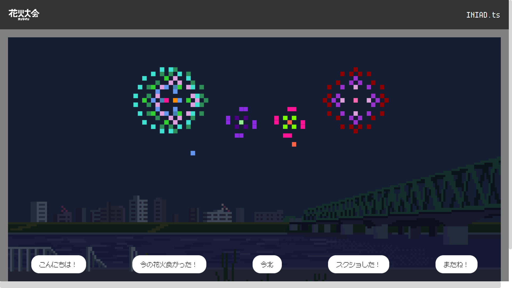

# 🎆 花火大会アプリ 🎆

このプロジェクトは、ユーザーが花火を選択し、花火大会を楽しむためのアプリケーションです。自分だけの花火を作成して、他のユーザーと共有しましょう！



## 🌟 特徴

- **フロントエンド**: Next.js
- **バックエンド**: Fastify
- **ORM**: Prisma + PostgreSQL
- **認証**: AWS Cognito
- **オブジェクトストレージ**: AWS S3 または Cloudflare R2

## 🚀 クイックスタート

### Node.js のインストール

まずは Node.js をインストールします。バージョンは v20 以上を推奨します。

[Node.js ダウンロードページ](https://nodejs.org/)

### リポジトリのクローン

以下のコマンドでリポジトリをクローンします。

```sh
$ git clone https://github.com/your-repo/hackathon-vol14.git
$ cd hackathon-vol14
$ rm -rf .git # 既存のコミット履歴を削除
$ git init
```

### 依存関係のインストール

プロジェクトの依存関係をインストールします。

```sh
$ npm i
$ npm i --prefix client
$ npm i --prefix server
```

### 環境変数ファイルの作成

環境変数ファイルを作成します。

```sh
$ cp client/.env.example client/.env
$ cp server/.env.example server/.env
```

### Docker Compose の起動

Docker Compose を使用して必要なサービスを起動します。

```sh
$ docker compose up -d
```

### 開発サーバーの起動

開発サーバーを起動します。次回以降はこのコマンドだけで開発を開始できます。

```sh
$ npm run dev
```

ブラウザで [http://localhost:3000](http://localhost:3000) を開いてアプリケーションを確認しましょう。

### ローカルでのアカウント作成方法

Docker の Inbucket に仮想メールが届くため、任意のメールアドレスでアカウントを作成できます。検証コードを含めて開発時のメールは全て [http://localhost:2501](http://localhost:2501) の「Recent Mailboxes」に届きます。

## 🌍 デプロイ

このプロジェクトは `Dockerfile` を使用して簡単にデプロイできます。

### データベース

このプロジェクトは `PostgreSQL` を使用しています。

### デプロイ検証済み PaaS

- [Render](https://render.com)
- [Railway](https://railway.app)

### 外部連携サービス

- AWS Cognito
- AWS S3 または Cloudflare R2

ヘルスチェック用エンドポイント: `/api/health`

### Dockerfile を用いたデプロイ時の環境変数

```sh
NEXT_PUBLIC_COGNITO_USER_POOL_CLIENT_ID=
NEXT_PUBLIC_COGNITO_USER_POOL_ID=
NEXT_PUBLIC_COGNITO_POOL_ENDPOINT=
DATABASE_URL=
S3_ACCESS_KEY=
S3_BUCKET=
S3_ENDPOINT=
S3_REGION=
S3_SECRET_KEY=
PORT= # optional
```

#### MinIO Console

[http://localhost:9001](http://localhost:9001)

#### PostgreSQL UI

```sh
$ cd server
$ npx prisma studio
```

## 🎉 楽しんでください！

このプロジェクトを楽しんでいただけると幸いです。フィードバックや貢献は大歓迎です！
